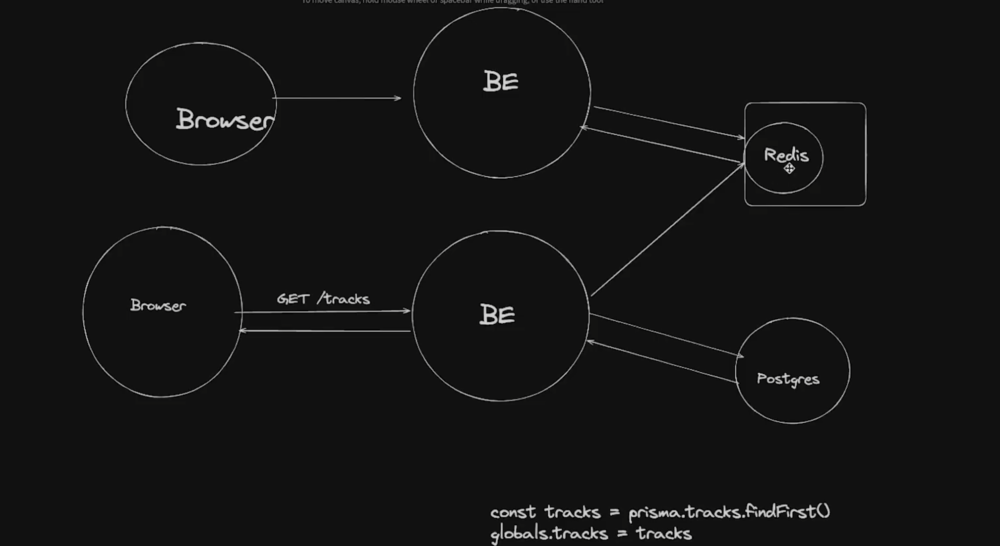
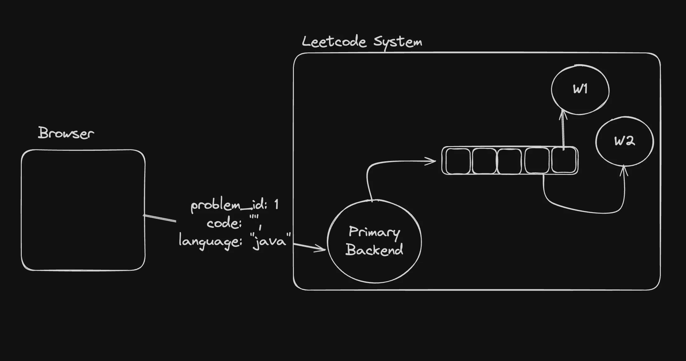

# **Architecture**
## High level system


## Redis as a Queue


<br>

# **Starting redis locally**

Let’s start redis locally and start using it as a DB

```bash
docker run --name my-redis -d -p 6379:6379 redis
```

Connecting to your container

```bash
docker exec -it container_id /bin/bash

# docker exec -it 018wedfabefa367 /bin/bash
```

Connecting to the redis cli

```bash
redis-cli
```

<br>

# Initialize bun project
```bash
# cd express-server
# cd worker
bun init -y
```

## Update ```tsconfig.json``` in both folder
``` bash
"rootDir": "./src",
"outDir": "./dist",
```

## Build ts file
``` bash
tsc -b
```
## Run the server in ```express-server``` and ```worker```
``` bash
node dist/index.js
```

<br>


